# Dashboard de Accidentes Viales en CDMX — 2024

Visualización interactiva y análisis exploratorio de los incidentes de tránsito registrados en la Ciudad de México durante el año 2024.
Este proyecto permite explorar la información geográfica y temporal de los accidentes, así como sus consecuencias en términos de víctimas, tipos de evento y prioridad de atención.

## Contenido

* [Accede al Dashboard](#accede-al-dashboard)
* [Documentación técnica](#documentación-técnica)
* [Capturas del Dashboard](#capturas-del-dashboard)
* [Estructura del repositorio](#estructura-del-repositorio)
* [Tecnologías utilizadas](#tecnologías-utilizadas)
* [Cómo ejecutarlo localmente](#cómo-ejecutarlo-localmente)
* [Licencia y créditos](#licencia-y-créditos)

## Accede al Dashboard

**Sitio web del Dashboard**
https://accidentes-mx-dashboard.onrender.com

> **Nota:** El dashboard está alojado en [Render.com](https://render.com/) bajo un plan gratuito.
> La carga inicial puede tardar hasta **1 minuto**.

## Documentación técnica

Toda la documentación del desarrollo, incluyendo la estructura del proyecto, las decisiones, los análisis y las tareas, está disponible en el siguiente espacio de Notion:

**Notion del proyecto**
[Ver documentación en Notion](https://www.notion.so/23f668222f9580d9800ac64660d8ab5e?v=23f668222f958135860a000cca701f3f&source=copy_link)

## Capturas del Dashboard

### Indicadores clave (KPIs)

<p align="center">
  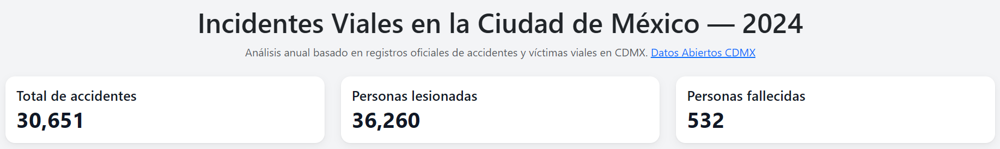
</p>

<p>
  <em>
  Resumen general del impacto vial en la CDMX durante 2024,  
  mostrando el total de accidentes registrados y sus consecuencias en personas lesionadas y fallecidas.
  </em>
</p>

### Accidentes por alcaldía

<p align="center">
  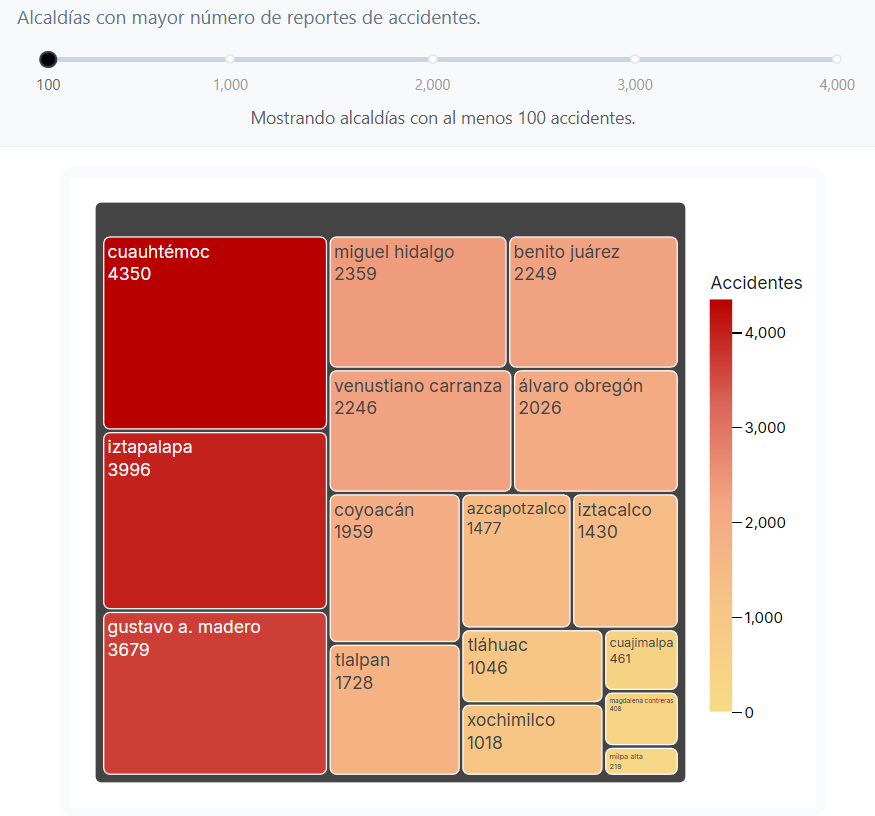
</p>

<p>
  <em>
  Treemap que resalta las alcaldías con mayor número de reportes.  
  El tamaño y el color indican el volumen de accidentes, destacando zonas críticas como  
  <b>Cuauhtémoc</b>, <b>Iztapalapa</b> y <b>Gustavo A. Madero</b>.
  </em>
</p>

### Mapa de incidentes

<p align="center">
  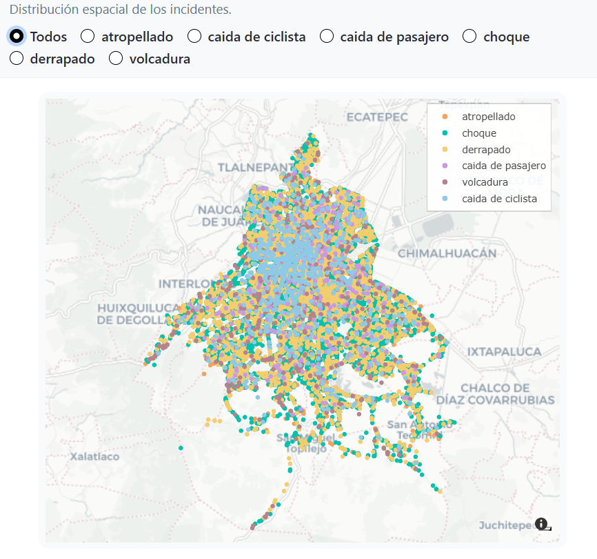
</p>

<p>
  <em>
  Mapa interactivo que muestra la localización de los diferentes tipos de incidentes viales en la Ciudad de México.  
  Los <b>choques</b> concentran la mayor cantidad de registros, mientras que las <b>caídas de pasajero y ciclista</b> se presentan con menor frecuencia.
  </em>
</p>

### Prioridad de atención en incidentes

<p align="center">
  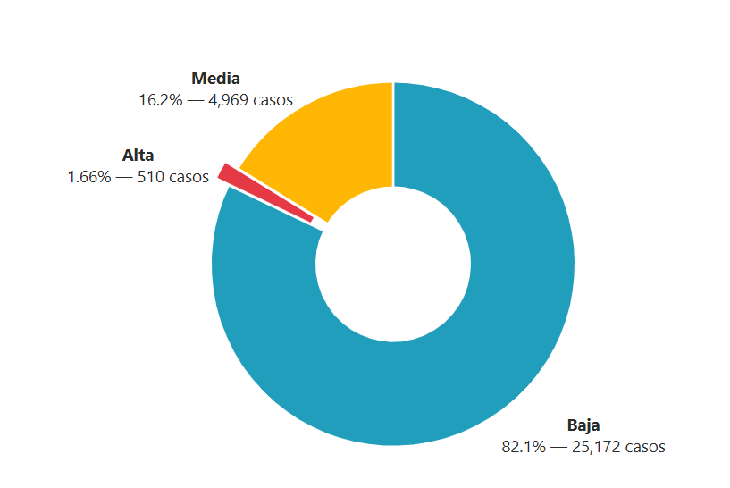
</p>

<p>
  <em>
  La mayoría de los incidentes viales se clasifican como de <b>prioridad baja</b>, lo que representa más del 80% de los casos.  
  En contraste, solo un pequeño porcentaje requiere <b>prioridad alta</b>, lo que indica que los siniestros más graves son menos frecuentes.
  </em>
</p>

### Accidentes por hora del día

<p align="center">
  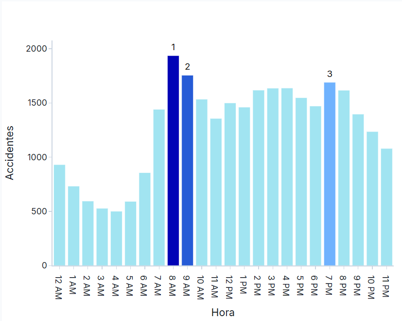
</p>

<p>
  <em>
  La distribución horaria muestra que los <b>picos de accidentes</b> ocurren principalmente en la mañana, entre las <b>7 y 9 AM</b>, coincidiendo con la hora de mayor movilidad laboral y escolar.  
  Un segundo repunte se observa hacia la <b>tarde-noche (7 PM)</b>, reflejando también el regreso a casa.
  </em>
</p>

### Patrones de accidentes por día y hora

<p align="center">
  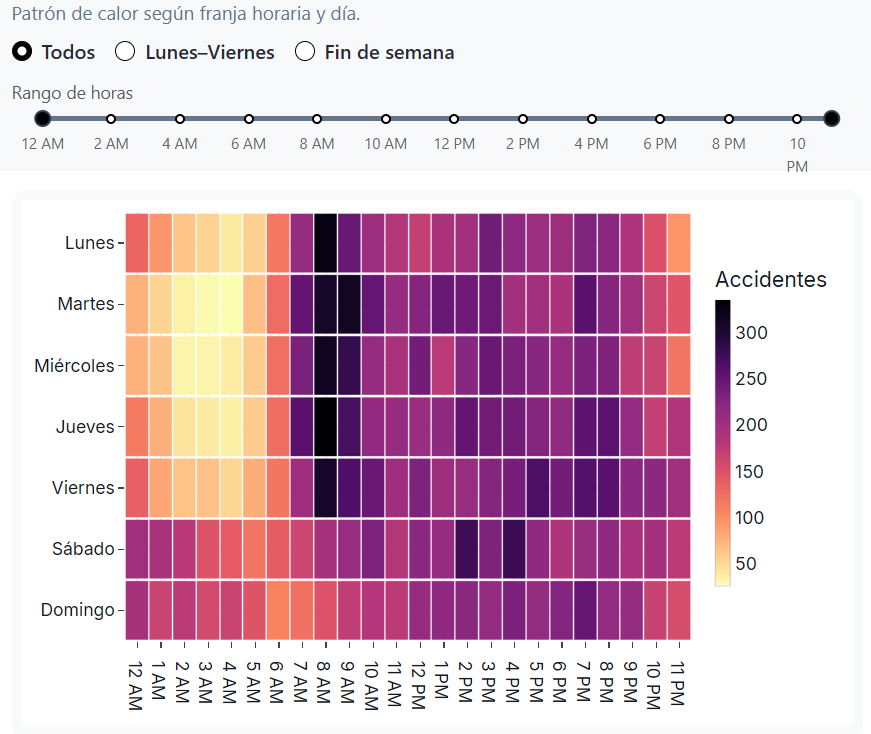
</p>

<p>
  <em>
  El mapa de calor revela una clara concentración de accidentes durante las <b>mañanas de lunes a viernes (7–9 AM)</b>,  
  asociada con el inicio de la jornada laboral y escolar.  
  En contraste, los fines de semana presentan una distribución más dispersa, con menor intensidad en las horas tempranas.
  </em>
</p>

### Fallecidos por mes

<p align="center">
  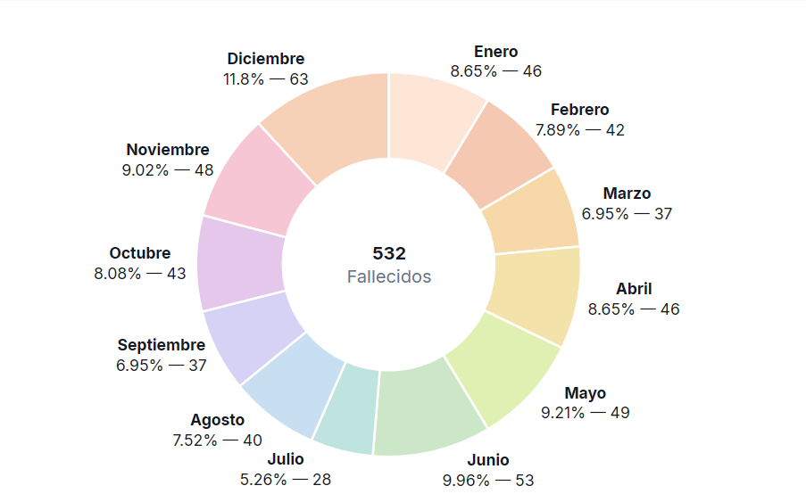
</p>

<p>
  <em>
  La distribución mensual muestra que los fallecimientos se concentran en algunos meses específicos.  
  <b>Diciembre</b> y <b>junio</b> registran los valores más altos, mientras que <b>julio</b> presenta el menor número de víctimas.  
  Este patrón refleja posibles variaciones estacionales en la siniestralidad vial.
  </em>
</p>

### Tendencia mensual de accidentes

<p align="center">
  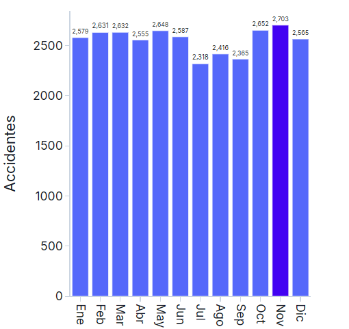
</p>

<p>
  <em>
  La serie mensual muestra que los accidentes se mantienen relativamente constantes a lo largo del año,  
  aunque destaca <b>noviembre</b> como el mes con mayor número de siniestros.  
  En contraste, <b>julio</b> registra la menor cantidad de incidentes.
  </em>
</p>

### Fallecidos por alcaldía

<p align="center">
  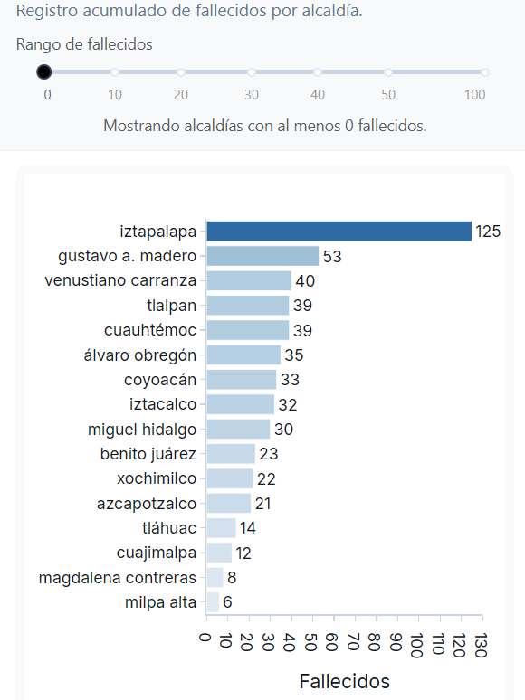
</p>

<p>
  <em>
  El análisis muestra que <b>Iztapalapa</b> concentra la mayor cantidad de fallecidos por accidentes viales,  
  seguida por <b>Gustavo A. Madero</b> y <b>Venustiano Carranza</b>.  
  En contraste, alcaldías como <b>Milpa Alta</b> y <b>Magdalena Contreras</b> presentan los valores más bajos.
  </em>
</p>

### Accidentes por tipo de evento

<p align="center">
  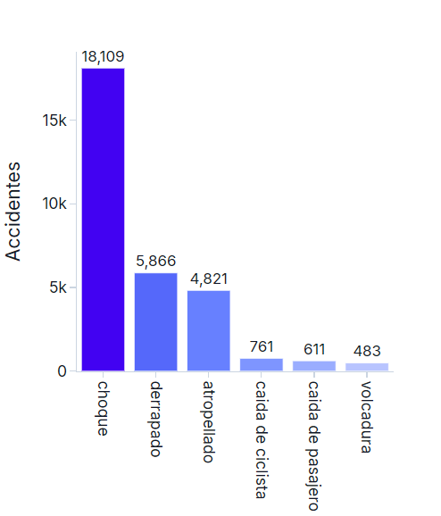
</p>

<p>
  <em>
  La mayoría de los incidentes viales corresponden a <b>choques</b>, con una diferencia muy marcada frente al resto de categorías.  
  Los <b>derrapes</b> y <b>atropellamientos</b> aparecen en un segundo nivel de frecuencia,  
  mientras que las <b>volcaduras</b> y las <b>caídas de pasajero o ciclista</b> son los eventos menos comunes.
  </em>
</p>

### Comparativo de lesionados y fallecidos

<p align="center">
  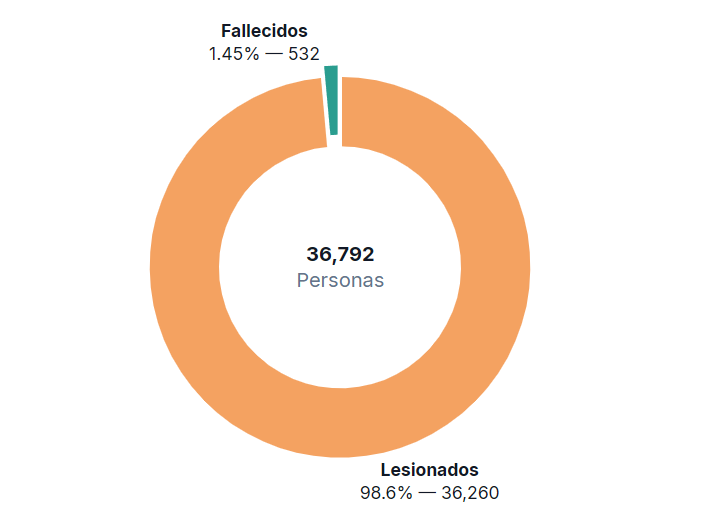
</p>

<p>
  <em>
  El comparativo evidencia que la gran mayoría de las víctimas de incidentes viales resultan <b>lesionadas</b> (más del 98%),  
  mientras que los <b>fallecimientos</b> representan apenas una fracción mínima del total (alrededor del 1.5%).  
  Aunque el número de muertes es reducido en proporción, cada caso refleja un impacto crítico en la seguridad vial.
  </em>
</p>

## Estructura del repositorio

```text
accidentes-mx-dashboard/
├── dashboard/
│   ├── assets/                         # Imágenes y recursos visuales del dashboard
│   ├── modules/                        # Módulos reutilizables: layouts, filtros y gráficas
│   └── app.py                          # Archivo principal de la aplicación en Dash
│
├── data/
│   ├── accidentes_cdmx.csv             # Dataset original
│   └── accidentes_cdmx_limpio.csv      # Dataset limpio y preparado para el análisis
│
├── notebooks/
│   ├── 01_exploracion_inicial.ipynb    # Exploración básica del dataset
│   ├── 02_limpieza_transformacion.ipynb
│   ├── 03_analisis_exploratorio.ipynb  # Análisis y pruebas de visualización
│   ├── app_v1_prototipo.py             # Primera versión antes de modularizar
│   └── app.py                          # Versión de la aplicación en notebooks
│
├── requirements.txt                    # Dependencias necesarias para ejecutar la aplicación
├── README.md                           # Documentación principal del proyecto
├── .gitignore                          # Archivos y carpetas ignorados por Git
└── venv/                               # Entorno virtual local, no incluido en GitHub
```

## Tecnologías utilizadas

Este proyecto se desarrolló principalmente en **Python 3.13.6**, utilizando las siguientes librerías y frameworks:

* **Dash 3.2.0** - Framework principal para la creación del dashboard.
* **Plotly 6.3.0** - Gráficos interactivos y visualizaciones dinámicas.
* **Dash Bootstrap Components 2.0.3** - Componentes de interfaz y diseño responsivo.
* **Pandas 2.3.1** y **NumPy 2.3.2** - Manipulación y análisis de datos.
* **Flask 3.1.1** - Servidor web base utilizado por Dash.
* **Gunicorn 21.2.0** - Servidor WSGI utilizado para el despliegue en producción mediante Render.

Además, durante las etapas exploratorias también se utilizaron **Streamlit 1.38.0** y **Altair 5.5.0** en los notebooks de análisis.

## Cómo ejecutarlo localmente

### 1. Clonar el repositorio

Abre una terminal y ejecuta:

```bash
git clone git@github.com:SaulRovelo/accidentes-mx-dashboard.git
cd accidentes-mx-dashboard
```

### 2. Crear un entorno virtual e instalar las dependencias

```bash
# Linux / macOS
python -m venv venv
source venv/bin/activate

# Windows
python -m venv venv
venv\Scripts\activate

# Instalar las dependencias
pip install -r requirements.txt
```

### 3. Ejecutar la aplicación

```bash
python dashboard/app.py
```

### 4. Abrir la aplicación en el navegador

Una vez que la aplicación esté en ejecución, abre tu navegador y visita:

http://localhost:8050

## Licencia y créditos

Este proyecto fue desarrollado con fines **educativos y de portafolio profesional**.
El dataset base proviene del portal oficial de [Datos Abiertos de la Ciudad de México](https://datos.cdmx.gob.mx/).

---

Desarrollado por [SaulRovelo](https://github.com/SaulRovelo)
